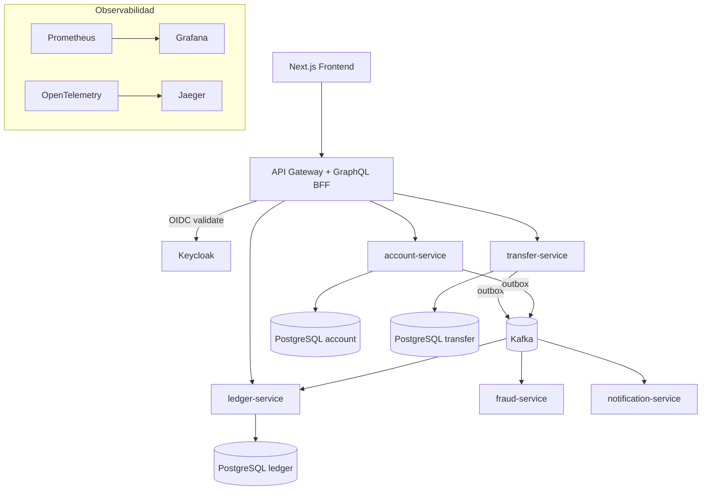
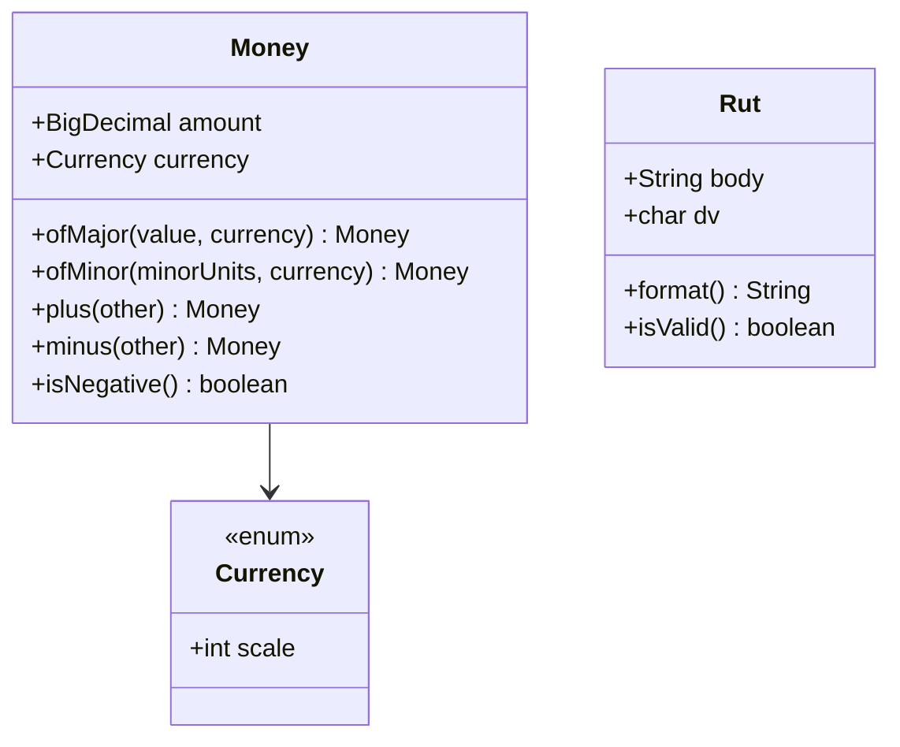
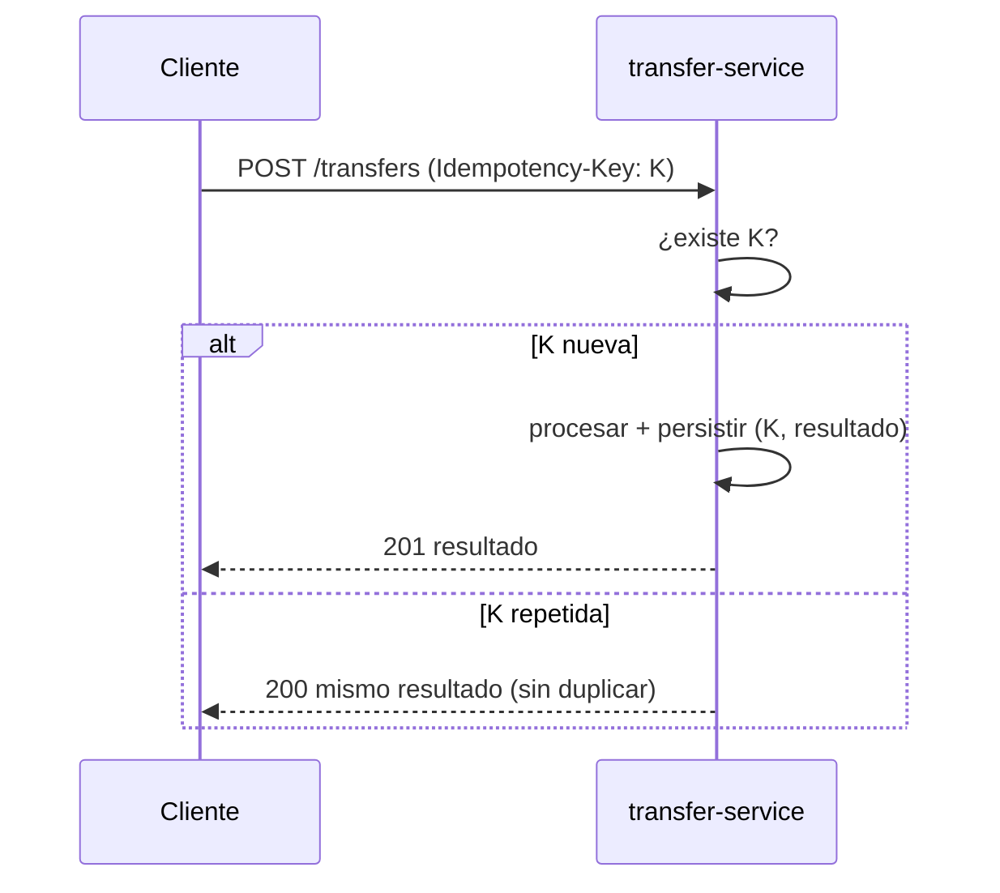
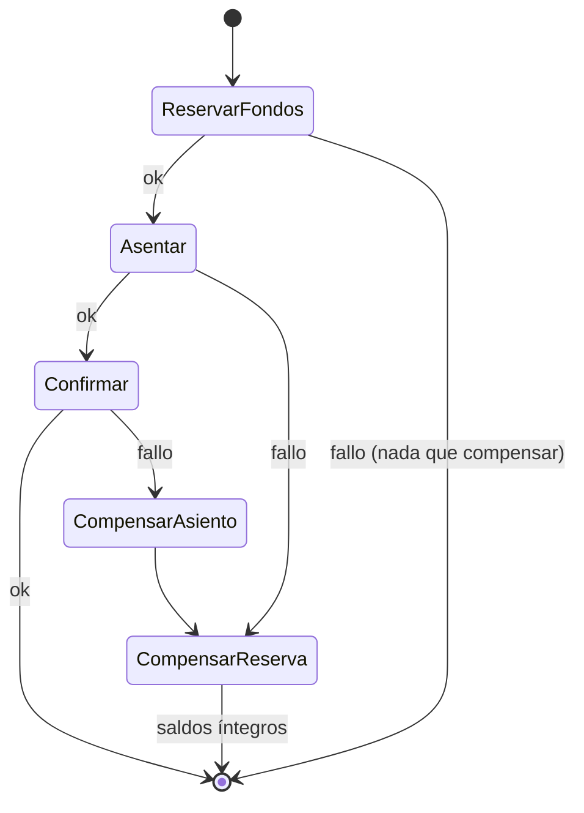
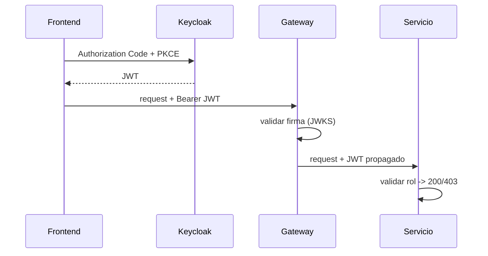

# Diseño — NeoBank (Fintech / Core Bancario Ligero, contexto banca chilena)

> Documento de diseño técnico. Toda la documentación del proyecto está en español. La aplicación
> es multilenguaje español/inglés (es-CL por defecto).

## 1. Visión general

NeoBank es una plataforma de banca digital construida como **monorepo de microservicios** en
Spring Boot 3 / Java 21, orientada a **banca chilena** (RUT, CLP, UF, bancos de la plaza local).
El corazón del sistema es un **ledger inmutable de doble entrada** alimentado por
**transferencias idempotentes** publicadas mediante **Outbox pattern** hacia Kafka, y coordinadas
por una **saga** con compensación.

Objetivos de diseño:
- **Correctitud financiera:** dinero como value object con `BigDecimal` y scale por moneda; nunca `double`.
- **Consistencia distribuida:** idempotencia + outbox + saga.
- **Auditabilidad:** ledger inmutable de doble entrada.
- **Operabilidad:** observabilidad, CI/CD, IaC.
- **Accesibilidad de portafolio:** demo pública 24/7 + evidencia de skill cloud on-demand.

## 2. Arquitectura de referencia



### Servicios

| Servicio | Responsabilidad | Persistencia | Interfaz |
|---|---|---|---|
| `api-gateway` | Enrutamiento, seguridad, rate limit, circuit breaker, GraphQL BFF | — | REST (proxy) + GraphQL |
| `account-service` | Cuentas, titulares (RUT), tipos de cuenta, banco | PostgreSQL `account` | REST |
| `ledger-service` | Asientos de doble entrada, saldos derivados | PostgreSQL `ledger` | REST + consumer Kafka |
| `transfer-service` | Transferencias idempotentes, saga, outbox | PostgreSQL `transfer` | REST + producer Kafka |
| `fraud-service` | Reglas de fraude sobre eventos | (stateless / mem) | consumer/producer Kafka |
| `notification-service` | Notificaciones asíncronas (mock) | (stateless) | consumer Kafka |
| Keycloak | IdP OIDC (realm, clients, roles) | (propia) | OIDC |

## 3. Estructura del monorepo (Gradle Kotlin DSL, multi-módulo)

```
antu-bank/
├── settings.gradle.kts          # incluye todos los módulos
├── build.gradle.kts             # convención raíz (versión Java 21, plugins comunes)
├── gradle/libs.versions.toml     # version catalog centralizado
├── buildSrc/ o convention plugins  # convenciones compartidas (spring, testing)
├── common-domain/               # value objects: Money, Rut, Currency; base compartida
├── services/
│   ├── account-service/
│   ├── ledger-service/
│   ├── transfer-service/
│   ├── fraud-service/
│   ├── notification-service/
│   └── api-gateway/
├── frontend/                    # Next.js (React) i18n es/en
├── infra/
│   ├── docker-compose.yml       # local: PostgreSQL x N, Kafka, Keycloak
│   ├── keycloak/realm-export.json
│   ├── k8s/ o helm/             # manifiestos on-demand
│   └── terraform/               # EKS + RDS + MSK
└── .kiro/specs/neobank/         # requirements.md, design.md, tasks.md
```

Cada servicio es un módulo Gradle con su propio `build.gradle.kts` y Dockerfile, deployable de
forma independiente. `common-domain` no depende de Spring (dominio puro) para mantenerlo testeable
y reusable.

## 4. Diseño del dominio compartido (`common-domain`)

### 4.1 `Currency` y scale por moneda

```
enum Currency { CLP(scale=0), USD(scale=2), UF(scale=2) }
```

El scale determina la cantidad de decimales y el factor de minor units. CLP no usa decimales
(scale 0), por lo que sus minor units son pesos enteros.

### 4.2 Value object `Money`

Atributos: `amount: BigDecimal` (normalizado al scale de la moneda) y `currency: Currency`.

Invariantes y comportamiento:
- Construcción normaliza el `BigDecimal` al scale de la moneda con redondeo `HALF_EVEN`.
- `plus`/`minus` exigen misma moneda; si difieren, lanzan excepción de dominio.
- Métodos de fábrica: `Money.ofMajor(...)` (unidades mayores) y `Money.ofMinor(...)` (minor units).
- Comparaciones y `equals`/`hashCode` por valor (inmutable).
- Soporte para prohibir negativos donde el contexto lo requiera (validación en el borde de negocio, no en el tipo, para permitir asientos de débito).

### 4.3 Value object `Rut`

- Construcción a partir de string; normaliza (quita puntos/guion), separa cuerpo y DV.
- Valida DV con **módulo 11**.
- `format()` entrega representación chilena `12.345.678-5`.
- Igualdad por valor.



## 5. Diseño por servicio

### 5.1 account-service
- Entidad `Account`: id, `Rut` titular, nombre titular, tipo (`CORRIENTE`/`VISTA`/`AHORRO`), banco (código plaza chilena), moneda, timestamps.
- REST: `POST /accounts`, `GET /accounts/{id}`, `GET /accounts?rut=`.
- Validación con Bean Validation + validador custom de RUT.
- Errores en formato `ProblemDetail` (RFC 7807), mensajes localizables (es/en) vía `MessageSource`.
- Flyway para migraciones; Testcontainers para integración.

### 5.2 ledger-service
- Entidad `LedgerTransaction` con N `LedgerEntry` (débito/crédito). Invariante Σ = 0 validado en dominio y por constraint/trigger.
- Asientos inmutables (sin update/delete). Saldo = Σ asientos por cuenta.
- Consumer de eventos `TransferConfirmed` para asentar.

### 5.3 transfer-service
- Entidad `Transfer` + `IdempotencyKey` (única). Tabla `outbox`.
- Flujo (Task 4 síncrono → Task 5/6 event-driven + saga):
  - Recibe `Idempotency-Key`; si existe, retorna resultado previo.
  - Valida fondos; ejecuta saga; escribe evento en outbox en la misma transacción.

### 5.4 fraud-service / notification-service
- fraud: reglas de monto y velocidad con umbrales en CLP; emite `TransferFlagged`.
- notification: consume eventos notificables; notificación mock; contenido localizable es/en.

### 5.5 api-gateway
- Spring Cloud Gateway: rutas a servicios, propagación de token, rate limiting, Resilience4j.
- Spring for GraphQL: schema BFF que agrega REST internos (`me { accounts, balances, history }`).

## 6. Patrones clave

### 6.1 Idempotencia


### 6.2 Outbox pattern
```mermaid
sequenceDiagram
    participant T as transfer-service
    participant DB as PostgreSQL (transfer)
    participant R as Outbox Relay
    participant K as Kafka
    participant L as ledger-service
    T->>DB: BEGIN; guardar Transfer + evento en outbox; COMMIT
    R->>DB: leer outbox pendientes
    R->>K: publicar evento
    R->>DB: marcar publicado
    K->>L: consumir evento -> asentar
```

### 6.3 Saga de transferencia (orquestación + compensación)


## 7. Seguridad (Keycloak / OIDC)

- **Realm** `neobank` versionado en `infra/keycloak/realm-export.json`.
- **Clients:** `neobank-frontend` (público, Authorization Code + PKCE) y clients confidential por servicio.
- **Roles:** `CUSTOMER`, `ADMIN`.
- **Validación:** servicios como resource servers validan JWT contra el **JWKS** de Keycloak (sin llamar a Keycloak por request).
- **Gateway:** valida token en el borde y propaga a downstream.
- **Auditoría:** log de accesos con usuario, rol, endpoint y resultado.



## 8. Internacionalización (i18n)

- **Frontend:** librería i18n (next-intl / next-i18next) con catálogos `es` (default) y `en`; selector de idioma; formateo de montos/fechas por locale (`es-CL`).
- **Backend:** `MessageSource` con `messages_es.properties` (default) y `messages_en.properties` para mensajes de error y notificaciones; el idioma se resuelve por header `Accept-Language`.
- **Documentación:** siempre en español.

## 9. Estrategia de entornos y despliegue

| Entorno | Infra | Perfil | Propósito |
|---|---|---|---|
| Local | docker-compose (PostgreSQL x N, Kafka, Keycloak) | `local` | Desarrollo, stack fiel |
| Público | Vercel + Render/Fly.io + Kafka gestionado free + 1 PostgreSQL (schemas) | `demo` | Portafolio 24/7 |
| AWS | Terraform → EKS + RDS + MSK + Helm | `prod` | Demo de skill cloud on-demand |

Perfil `demo` reducido: consolida contenedores y usa un PostgreSQL con schemas por servicio y
Kafka gestionado gratuito, manteniendo la app 100% testeable. Local/AWS usan database-per-service
estricto.

## 10. Observabilidad

- **Métricas:** Micrometer → Prometheus; dashboards Grafana (latencia, error rate, throughput).
- **Trazas:** OpenTelemetry → Jaeger; propagación de contexto gateway → transfer → ledger.
- **Logs:** JSON estructurado → Loki; correlación por trace-id.

## 11. Testing

- **Unitarios:** dominio (`Money`, `Rut`), reglas de fraude, saga.
- **Integración:** Testcontainers (PostgreSQL real, Kafka real).
- **Contrato/API:** OpenAPI; tests de slices web y repositorio.
- **Frontend:** Testing Library (componentes clave, flujo de transferencia).
- **End-to-end:** flujo login → cuentas → transferencia → historial.

## 12. Decisiones de arquitectura (ADRs)

> Los ADRs se consolidaron como documentación independiente y versionada en
> [`docs/adr/`](../../../docs/adr/README.md) (un archivo por decisión, con contexto y consecuencias
> ampliados). Las entradas de abajo son el resumen original que dio origen a esos ADRs; para el
> detalle completo, ver el índice en `docs/adr/`.

### ADR-001: Gradle (Kotlin DSL) sobre Maven
**Decisión:** usar Gradle con Kotlin DSL y version catalog.
**Motivo:** builds incrementales y cache superiores en monorepo multi-módulo, tipado en el DSL,
mejor manejo de convenciones compartidas. **Trade-off:** curva de convención plugins.

### ADR-002: `Money` con `BigDecimal` y scale por moneda (nunca double)
**Decisión:** value object inmutable con scale por moneda (CLP=0, USD=2, UF=2).
**Motivo:** correctitud financiera; CLP no usa decimales. **Trade-off:** más código que un `double`,
pero es requisito no negociable en fintech.

### ADR-003: `Rut` como value object con validación módulo 11
**Decisión:** identidad de clientes/cuentas basada en RUT validado.
**Motivo:** fidelidad al dominio bancario chileno; evita RUT inválidos en el sistema.

### ADR-004: Database-per-service estricto (local/AWS)
**Decisión:** cada servicio con su PostgreSQL.
**Motivo:** aislamiento, autonomía de despliegue, fidelidad a microservicios.
**Trade-off:** más infra; se mitiga con perfil `demo` (schemas) en público.

### ADR-005: Outbox pattern para consistencia Kafka+DB
**Decisión:** persistir eventos en outbox dentro de la transacción de negocio + relay.
**Motivo:** resuelve el problema de dual-write. **Trade-off:** relay adicional y latencia eventual.

### ADR-006: Saga orquestada para transferencias
**Decisión:** orquestación explícita con compensación.
**Motivo:** claridad de flujo y control de compensaciones frente a coreografía.
**Trade-off:** un orquestador con estado.

### ADR-007: Keycloak como IdP en lugar de Authorization Server propio
**Decisión:** Keycloak self-hosted (OIDC).
**Motivo:** estándar de industria, menos boilerplate, muy vendible. **Trade-off:** operar Keycloak.

### ADR-008: GraphQL como BFF en el gateway
**Decisión:** capa GraphQL de agregación en el gateway sobre REST internos.
**Motivo:** un contrato eficiente para el frontend; los servicios internos siguen REST simples.

### ADR-009: Despliegue doble track (público always-on + AWS on-demand)
**Decisión:** Vercel + Render/Fly.io siempre encendido; Terraform/EKS on-demand.
**Motivo:** accesibilidad 24/7 para reclutadores sin costo permanente, conservando evidencia cloud.
**Trade-off:** mantener dos configuraciones de despliegue.

### ADR-010: i18n es/en con español por defecto; documentación en español
**Decisión:** app bilingüe (es-CL default), docs solo en español.
**Motivo:** contexto chileno + accesibilidad para reclutadores hispano/anglo.
