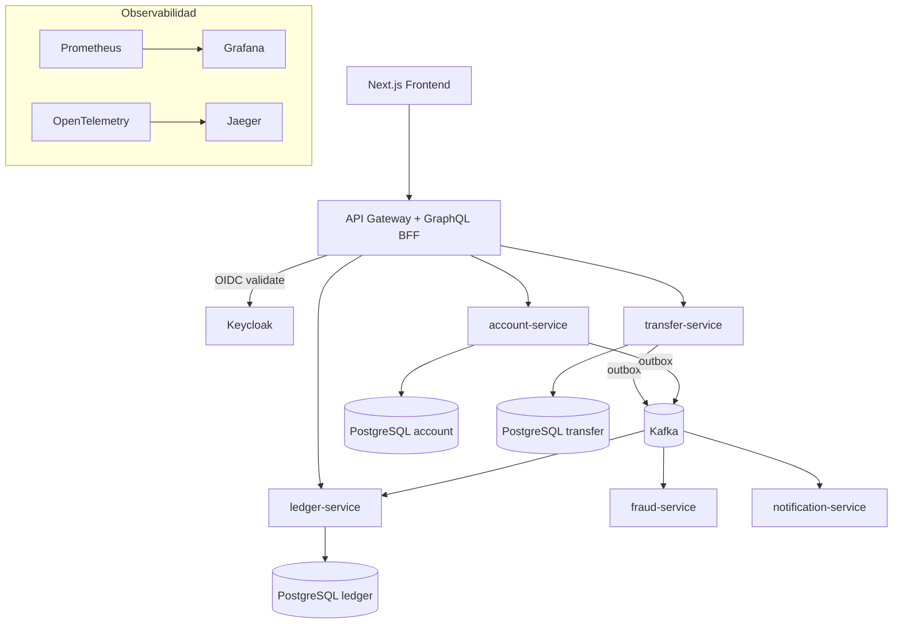
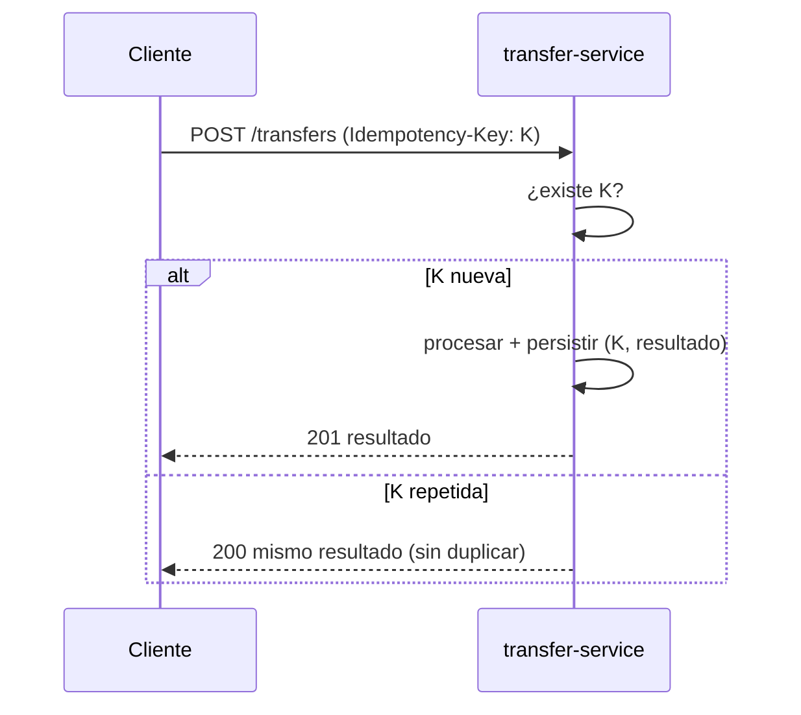
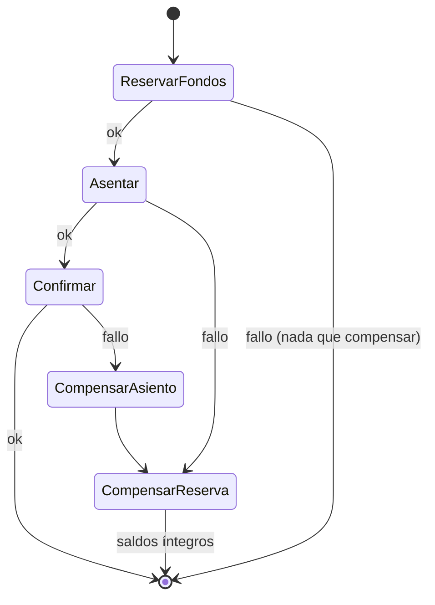

# Antu Bank (NeoBank) — Core Bancario Ligero / Fintech

> Plataforma de banca digital construida como **monorepo de microservicios** en **Java 21 /
> Spring Boot 3**, con contexto de **banca chilena** (RUT, CLP/UF, bancos de la plaza local).
> El corazón del sistema es un **ledger inmutable de doble entrada** alimentado por
> **transferencias idempotentes**, publicadas con **Outbox pattern** hacia Kafka y coordinadas
> por una **saga** con compensación.
>
> Toda la documentación está en español. La aplicación es bilingüe **español/inglés**
> (es-CL por defecto).

---

## Tabla de contenidos

- [1. ¿Qué es Antu Bank?](#1-qué-es-antu-bank)
- [2. Highlights](#2-highlights)
- [3. Arquitectura](#3-arquitectura)
  - [3.1 Arquitectura de referencia](#31-arquitectura-de-referencia)
  - [3.2 Servicios](#32-servicios)
  - [3.3 Patrones clave](#33-patrones-clave)
- [4. Stack tecnológico](#4-stack-tecnológico)
- [5. Estructura del monorepo](#5-estructura-del-monorepo)
- [6. Puesta en marcha local (quick start)](#6-puesta-en-marcha-local-quick-start)
- [7. Demo pública](#7-demo-pública)
- [8. Tracks de despliegue](#8-tracks-de-despliegue)
- [9. Observabilidad](#9-observabilidad)
- [10. Testing](#10-testing)
- [11. Documentación adicional](#11-documentación-adicional)

---

## 1. ¿Qué es Antu Bank?

Antu Bank es un **core bancario ligero** (fintech) pensado como proyecto de portafolio que
demuestra arquitectura de microservicios lista para producción, aplicada a un dominio real:
la **banca chilena**.

El sistema modela clientes identificados por **RUT** (con validación de dígito verificador
módulo 11), cuentas en distintos **bancos de la plaza chilena**, y dinero en **CLP** (sin
decimales), **USD** y **UF**. Las transferencias entre cuentas se procesan de forma
idempotente y se reflejan en un libro contable de **doble entrada** que nunca se modifica ni
borra: el saldo siempre se deriva de los asientos.

El objetivo de diseño es la **correctitud financiera** (dinero como value object con
`BigDecimal`, nunca `double`), la **consistencia distribuida** (idempotencia + outbox + saga)
y la **auditabilidad** (ledger inmutable), todo con observabilidad, CI/CD e infraestructura
como código.

## 2. Highlights

- **Ledger inmutable de doble entrada** — invariante Σ = 0 por transacción; saldo derivado.
- **Transferencias idempotentes** — header `Idempotency-Key`; el mismo envío no duplica movimientos.
- **Outbox pattern** — evento y negocio en la misma transacción; relay publica a Kafka (sin dual-write).
- **Saga orquestada con compensación** — reservar → asentar → confirmar, con rollback lógico ante fallo.
- **Event-driven con Kafka** — fraude y notificaciones reaccionan a eventos de transferencia.
- **Seguridad OIDC con Keycloak** — Authorization Code + PKCE, JWT validado por JWKS, roles `CUSTOMER`/`ADMIN`.
- **BFF GraphQL en el gateway** — una query `me { accounts, balances, history }` que agrega los REST internos.
- **Resiliencia** — rate limiting y circuit breaker (Resilience4j) con fallback.
- **Contexto chileno + i18n** — RUT, CLP/UF, bancos reales; catálogos es/en (es-CL por defecto).
- **Observabilidad** — métricas (Prometheus/Grafana), trazas (OpenTelemetry/Jaeger) y logs JSON (Loki).
- **IaC + CI/CD** — Docker, Helm, Terraform (EKS + RDS + MSK) y GitHub Actions.

## 3. Arquitectura

### 3.1 Arquitectura de referencia



### 3.2 Servicios

| Servicio | Responsabilidad | Persistencia | Interfaz | Puerto local |
|---|---|---|---|---|
| `api-gateway` | Enrutamiento, seguridad, rate limit, circuit breaker, GraphQL BFF | — | REST (proxy) + GraphQL | `8080` |
| `account-service` | Cuentas, titulares (RUT), tipos de cuenta, banco | PostgreSQL `account` | REST | `8082` |
| `ledger-service` | Asientos de doble entrada, saldos derivados | PostgreSQL `ledger` | REST + consumer Kafka | `8083` |
| `transfer-service` | Transferencias idempotentes, saga, outbox | PostgreSQL `transfer` | REST + producer Kafka | `8084` |
| `fraud-service` | Reglas de fraude sobre eventos | (stateless) | consumer/producer Kafka | `8085` |
| `notification-service` | Notificaciones asíncronas (mock) | (stateless) | consumer Kafka | `8086` |
| Keycloak | IdP OIDC (realm `antu-bank`, clients, roles) | (propia) | OIDC | `8081` |

El módulo `common-domain` es dominio puro (sin Spring) y contiene los value objects
`Money`, `Rut` y el enum `Currency`, reutilizados por todos los servicios.

### 3.3 Patrones clave

**Idempotencia** — el mismo `Idempotency-Key` retorna el resultado previo sin duplicar:



**Outbox pattern** — evento y negocio en la misma transacción; el relay publica a Kafka:

```mermaid
sequenceDiagram
    participant T as transfer-service
    participant DB as PostgreSQL (transfer)
    participant R as Outbox Relay
    participant K as Kafka
    participant L as ledger-service
    T->>DB: BEGIN; guardar Transfer + evento en outbox; COMMIT
    R->>DB: leer outbox pendientes
    R->>K: publicar evento
    R->>DB: marcar publicado
    K->>L: consumir evento -> asentar
```

**Saga de transferencia** — orquestación con compensación por paso:



Para el detalle completo (dominio, seguridad, i18n y ADRs), ver
[`.kiro/specs/neobank/design.md`](.kiro/specs/neobank/design.md).

## 4. Stack tecnológico

| Área | Tecnologías |
|---|---|
| Lenguaje / runtime | Java 21 (toolchain) |
| Framework backend | Spring Boot 3, Spring Cloud Gateway, Spring for GraphQL, Resilience4j |
| Build | Gradle (Kotlin DSL), multi-módulo, version catalog, convention plugins |
| Persistencia | PostgreSQL 16 + Flyway |
| Mensajería | Apache Kafka (KRaft) |
| Identidad | Keycloak (OAuth2 / OIDC, JWT) |
| Frontend | Next.js (React), i18n es/en (next-intl) |
| Observabilidad | Micrometer + Prometheus, Grafana, OpenTelemetry + Jaeger, Loki |
| Contenedores / IaC | Docker (multi-stage), Helm, Terraform (EKS + RDS + MSK) |
| CI/CD | GitHub Actions |
| Testing | JUnit, Testcontainers (PostgreSQL/Kafka reales), Testing Library (frontend) |

## 5. Estructura del monorepo

```
antu-bank/
├── settings.gradle.kts          # incluye todos los módulos
├── build.gradle.kts             # configuración raíz
├── gradle/                      # wrapper + version catalog (libs.versions.toml)
├── build-logic/                 # convention plugins (java + spring-boot)
├── common-domain/               # dominio puro: Money, Rut, Currency, AccountType, ChileanBank
├── services/
│   ├── api-gateway/             # gateway + GraphQL BFF + resiliencia
│   ├── account-service/         # cuentas y titulares (RUT)
│   ├── ledger-service/          # asientos de doble entrada
│   ├── transfer-service/        # transferencias idempotentes + saga + outbox
│   ├── fraud-service/           # reglas de fraude sobre eventos
│   └── notification-service/    # notificaciones asíncronas
├── frontend/                    # Next.js (dashboard bancario, i18n es/en)
├── infra/
│   ├── docker-compose.yml       # stack local (PostgreSQL x N, Kafka, Keycloak, observabilidad)
│   ├── docker-compose.demo.yml  # perfil demo reducido
│   ├── keycloak/                # realm-export.json + guía de Keycloak
│   ├── prometheus/ grafana/ loki/  # configuración de observabilidad
│   ├── helm/                    # chart Helm para EKS/Kubernetes
│   ├── terraform/               # EKS + RDS + MSK
│   ├── render.yaml, fly/        # despliegue público (Render / Fly.io)
│   └── README-*.md              # guías de demo, deploy y AWS on-demand
├── .github/workflows/           # pipelines CI/CD (ci.yml, cd.yml)
└── .kiro/specs/neobank/         # requirements.md, design.md, tasks.md
```

## 6. Puesta en marcha local (quick start)

Requisitos: **JDK 21**, **Docker** (con Docker Compose) y **Node.js** (para el frontend).
El wrapper de Gradle (`./gradlew`) ya viene incluido.

### 6.1 Levantar la infraestructura local

Esto arranca PostgreSQL (uno por servicio), Kafka, Keycloak (realm `antu-bank`) y la stack de
observabilidad (Prometheus, Grafana, Jaeger, Loki):

```bash
docker compose -f infra/docker-compose.yml up -d
```

- Keycloak: <http://localhost:8081> (consola admin `admin` / `admin`, solo local)
- Grafana: <http://localhost:3001> · Prometheus: <http://localhost:9090> · Jaeger: <http://localhost:16686>

### 6.2 Compilar y correr los tests

```bash
./gradlew build      # compila todos los módulos
./gradlew test       # ejecuta la suite (incluye integración con Testcontainers)
```

### 6.3 Arrancar los microservicios

Cada servicio es un módulo Spring Boot independiente. Por ejemplo:

```bash
./gradlew :services:api-gateway:bootRun
./gradlew :services:account-service:bootRun
./gradlew :services:ledger-service:bootRun
./gradlew :services:transfer-service:bootRun
./gradlew :services:fraud-service:bootRun
./gradlew :services:notification-service:bootRun
```

El gateway queda en <http://localhost:8080> y expone el BFF GraphQL en `/graphql`
(playground GraphiQL en `/graphiql`).

### 6.4 Arrancar el frontend

```bash
cd frontend
npm install
npm run dev          # http://localhost:3000
```

Ver [`frontend/README.md`](frontend/README.md) para variables de entorno y detalles del frontend.

> Para el perfil **demo reducido** (un solo PostgreSQL con schemas y Kafka gestionado), ver
> [`infra/README-demo.md`](infra/README-demo.md).

## 7. Demo pública

> Los enlaces de abajo son **placeholders**: reemplázalos por las URLs reales una vez desplegado
> el track público (ver [§8](#8-tracks-de-despliegue) y [`infra/README-deploy.md`](infra/README-deploy.md)).

| Recurso | URL |
|---|---|
| Frontend (Vercel) | `https://<tu-app>.vercel.app` _(pendiente)_ |
| API Gateway | `https://<tu-gateway>` _(pendiente)_ |
| Swagger / OpenAPI | `https://<tu-gateway>/swagger-ui.html` _(pendiente)_ |
| Playground GraphQL (GraphiQL) | `https://<tu-gateway>/graphiql` _(pendiente)_ |

El frontend ofrece **auto-login guest / botón demo** con un tour guiado para reclutadores, así
que puedes explorar sin registrarte.

### Credenciales demo (solo demostración)

> ⚠️ **Estas credenciales son públicas y solo para la demo.** No representan datos reales ni
> deben reutilizarse en ningún entorno con información sensible.

| Usuario | Contraseña | Roles |
|---|---|---|
| `cliente.demo` | `demo1234` | `CUSTOMER` |
| `admin.demo` | `demo1234` | `ADMIN`, `CUSTOMER` |

Swagger y el playground GraphQL se exponen **públicamente** en la demo para poder inspeccionar
la API interactivamente. Para probar la API de extremo a extremo (obtener token, crear cuenta,
fondear, transferir con idempotencia, consultar el BFF GraphQL) hay una colección de pruebas
Bruno lista para usar: ver [`docs/api/README.md`](docs/api/README.md).

## 8. Tracks de despliegue

El proyecto usa un **despliegue de doble track**:

- **Público always-on (portafolio):** frontend en **Vercel** + backend en **Render/Fly.io** con
  perfil `demo` reducido (un PostgreSQL con schemas + Kafka gestionado gratuito). Mantiene la app
  accesible 24/7 sin costo permanente. Guía: [`infra/README-deploy.md`](infra/README-deploy.md).
- **AWS on-demand (evidencia de skill cloud):** **Terraform** levanta **EKS + RDS + MSK** y
  **Helm** despliega la app; se levanta y derriba a demanda para evitar costos. Guía de ciclo de
  vida: [`infra/README-aws-ondemand.md`](infra/README-aws-ondemand.md).

## 9. Observabilidad

- **Métricas:** Micrometer → Prometheus; dashboards de Grafana (latencia, error rate, throughput).
- **Trazas:** OpenTelemetry → Jaeger; el contexto cruza gateway → transfer → ledger.
- **Logs:** JSON estructurado → Loki, correlacionados por `trace-id`.

En local, la stack de observabilidad se levanta junto con `infra/docker-compose.yml`
(ver [§6.1](#61-levantar-la-infraestructura-local)).

## 10. Testing

- **Unitarios:** dominio (`Money`, `Rut`), reglas de fraude y saga.
- **Integración:** Testcontainers con PostgreSQL y Kafka reales (sin mocks de infraestructura).
- **Contrato / API:** OpenAPI + slices web y de repositorio.
- **Frontend:** Testing Library (componentes clave y flujo de transferencia).

```bash
./gradlew test              # backend (unitarios + integración)
cd frontend && npm test     # frontend (Testing Library / Vitest)
```

## 11. Documentación adicional

- **Diseño técnico:** [`.kiro/specs/neobank/design.md`](.kiro/specs/neobank/design.md)
- **API (OpenAPI/Swagger + colección Bruno):** [`docs/api/README.md`](docs/api/README.md)
- **ADRs (decisiones de arquitectura):** [`docs/adr/`](docs/adr/README.md)
- **Perfil demo reducido:** [`infra/README-demo.md`](infra/README-demo.md)
- **Despliegue público (Render/Fly + Vercel):** [`infra/README-deploy.md`](infra/README-deploy.md)
- **AWS on-demand (ciclo de vida):** [`infra/README-aws-ondemand.md`](infra/README-aws-ondemand.md)
- **Helm / Kubernetes:** [`infra/helm/README.md`](infra/helm/README.md)
- **Terraform (EKS + RDS + MSK):** [`infra/terraform/README.md`](infra/terraform/README.md)
- **CI/CD (GitHub Actions):** [`.github/README.md`](.github/README.md)
- **Keycloak (conceptos y setup):** [`infra/keycloak/README.md`](infra/keycloak/README.md)
- **Frontend:** [`frontend/README.md`](frontend/README.md)
