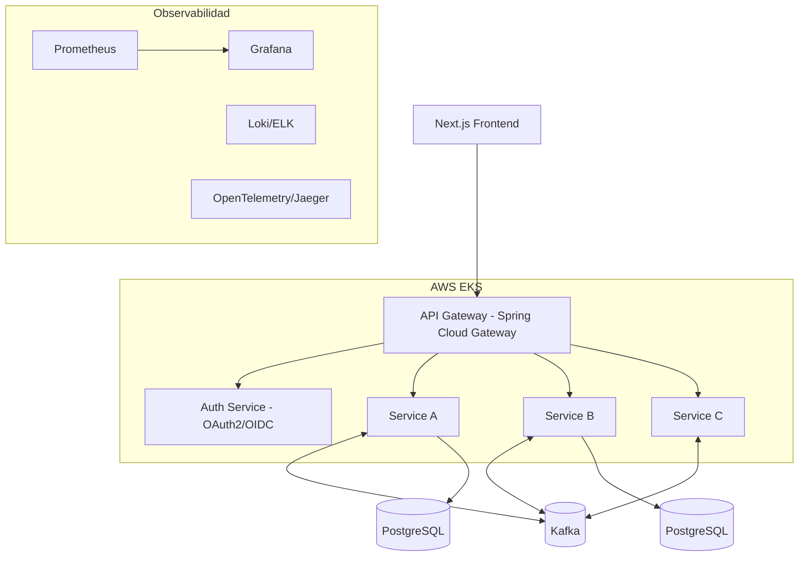

# NeoBank — Proyecto Estrella 1 (Fintech / Banca)

## Perfil objetivo

- **Producto estrella** terminado, desplegado y escalable
- **Dominio:** Fintech / Banca
- **Backend:** Spring Boot, JPA/Hibernate, REST + GraphQL, microservicios con Spring Cloud, Kafka
- **Frontend:** React con Next.js
- **Cloud:** AWS, con Docker + Kubernetes (EKS)
- **Extras:** CI/CD, observabilidad, seguridad avanzada (OAuth2/OIDC/JWT), documentación pro y demo en vivo

---

## Problem Statement

Necesitas destacar entre candidatos senior con proyectos que demuestren, de forma verificable, que sabes diseñar y operar sistemas reales, complejos y escalables. Este es uno de dos productos terminados y desplegados; cubre arquitectura de microservicios, mensajería asíncrona, seguridad de nivel bancario, cloud (AWS/EKS), observabilidad y CI/CD.

## Requirements

- Producto estrella con enfoque en producto terminado y escalable
- Dominio: Fintech / Banca
- Backend moderno: Spring Boot, JPA/Hibernate, REST + GraphQL
- Microservicios + Cloud: Spring Cloud, Kafka, Docker, Kubernetes, AWS
- Frontend: React + Next.js
- Extras (todos): CI/CD + observabilidad, seguridad avanzada, documentación + demo en vivo

## Background (decisiones de diseño y por qué impresionan)

- Fintech exige consistencia fuerte, idempotencia, auditoría y patrones de dinero (nunca `double` para montos, usar `BigDecimal`/minor units). Demostrar esto marca nivel senior real.
- Kafka permite mostrar arquitectura orientada a eventos (event-driven), desacople y resiliencia.
- AWS/EKS + Terraform + CI/CD + observabilidad demuestran que sabes operar, no solo programar.
- La demo en vivo + documentación con diagramas es lo que más convence a un reclutador en 5 minutos.

## Arquitectura de referencia

---

## Proyecto — "NeoBank" (Fintech / Core Bancario Ligero)

**Qué es:** Plataforma de banca digital con cuentas, transferencias, ledger de doble entrada, límites, y detección básica de fraude. El corazón es un **ledger inmutable con contabilidad de doble entrada** y **transferencias idempotentes** — exactamente lo que valida a un senior en fintech.

**Servicios:** `account-service`, `ledger-service`, `transfer-service`, `notification-service`, `fraud-service`, `api-gateway`, `auth-service`.

**Patrones clave:** Saga (orquestación de transferencias), Outbox pattern (consistencia Kafka+DB), idempotencia por `idempotency-key`, event sourcing en el ledger, auditoría inmutable.

### Task Breakdown

- [ ] **Task 1: Fundaciones del monorepo y contrato del dominio.** Crear estructura del repo (backend multi-módulo Maven/Gradle, frontend Next.js), definir modelos de dominio (Account, Money con `BigDecimal` en minor units, LedgerEntry). Configurar `docker-compose` local con PostgreSQL y Kafka. Tests unitarios del value object `Money` (suma, resta, redondeo, no permitir negativos donde aplique).
  - Demo: `docker-compose up` levanta infra local; tests de `Money` pasan en verde.

- [ ] **Task 2: account-service con CRUD de cuentas y persistencia.** Spring Boot + JPA, endpoints REST para crear/consultar cuentas, migraciones con Flyway, validación. Tests de integración con Testcontainers (PostgreSQL real).
  - Demo: crear una cuenta vía REST y consultarla; tests de integración verdes.

- [ ] **Task 3: ledger-service con contabilidad de doble entrada.** Implementar asientos inmutables (débito/crédito siempre balanceados), cálculo de saldo derivado de eventos, invariante "suma de asientos = 0". Tests que fuercen el invariante y rechacen asientos desbalanceados.
  - Demo: registrar asientos y ver saldo consistente; test demuestra rechazo de asientos inválidos.

- [ ] **Task 4: transfer-service con idempotencia.** Endpoint de transferencia que acepta `Idempotency-Key`; misma key retorna el mismo resultado sin duplicar. Persistir claves procesadas. Tests de concurrencia (misma transferencia enviada dos veces produce un solo movimiento).
  - Demo: enviar la misma transferencia dos veces; solo se aplica una.

- [ ] **Task 5: Event-driven con Kafka + Outbox pattern.** transfer-service publica eventos vía outbox (tabla + relay) para garantizar consistencia; ledger-service consume y asienta. Tests con Testcontainers Kafka verificando que un evento produce el asiento correspondiente.
  - Demo: una transferencia genera eventos consumidos por el ledger; saldos cuadran.

- [ ] **Task 6: Saga de transferencia (orquestación + compensación).** Flujo distribuido: reservar fondos → asentar → confirmar; si falla un paso, compensar. Tests de la saga en caminos feliz y de compensación (rollback).
  - Demo: transferencia exitosa completa; transferencia que falla se compensa y deja saldos íntegros.

- [ ] **Task 7: fraud-service (reglas básicas) + notification-service.** Consumir eventos de transferencia, aplicar reglas (monto/velocidad), marcar sospechosas; notificaciones asíncronas. Tests de reglas de fraude.
  - Demo: una transferencia sospechosa se marca y dispara notificación.

- [ ] **Task 8: auth-service + seguridad (OAuth2/OIDC + JWT + roles).** Login, tokens JWT, roles (CUSTOMER/ADMIN), refresh tokens, auditoría de accesos. Tests de autorización (403 en endpoints protegidos sin rol).
  - Demo: login, obtener JWT, acceder a endpoints según rol.

- [ ] **Task 9: api-gateway (Spring Cloud Gateway) + resiliencia.** Enrutamiento, rate limiting, circuit breaker (Resilience4j), propagación de token. Tests de rutas y de circuit breaker.
  - Demo: todo el tráfico pasa por el gateway con rate limit y fallback ante fallo.

- [ ] **Task 10: Frontend Next.js (dashboard bancario).** Login, ver cuentas/saldos, historial, iniciar transferencia con feedback de estado. Integración con auth y gateway. Tests de componentes clave.
  - Demo: usuario inicia sesión, ve saldo, hace una transferencia y ve el historial actualizado.

- [ ] **Task 11: Observabilidad (Prometheus, Grafana, tracing, logs).** Métricas con Micrometer, dashboards Grafana, trazas distribuidas con OpenTelemetry/Jaeger, logs estructurados.
  - Demo: dashboard mostrando latencia/errores y una traza que cruza gateway→transfer→ledger.

- [ ] **Task 12: Infra AWS + Kubernetes + CI/CD.** Dockerizar servicios, manifiestos K8s/Helm, Terraform para EKS + RDS + MSK, pipeline GitHub Actions (build, test, imagen, deploy).
  - Demo: push a main despliega automáticamente en EKS; app accesible por URL pública.

- [ ] **Task 13: Documentación pro + demo en vivo + hardening final.** README con arquitectura, diagramas, ADRs (decisiones de diseño), OpenAPI/Swagger, colección de pruebas, y URL de demo. Revisión de seguridad y pruebas end-to-end.
  - Demo: README navegable + demo desplegada + docs de API interactivas.

---

## Cómo destaca en el portafolio

El proyecto termina con demo en vivo, diagramas, ADRs (que muestran tu criterio senior), pruebas automatizadas y pipeline de despliegue. Eso responde de antemano la pregunta del reclutador: "¿sabe diseñar, construir y operar sistemas reales?".
